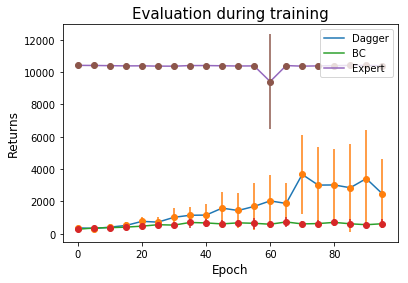

## Behavior Cloning: Performance after training BC


```
Left: Halfcheeth-v2, Right: Humanoid-v2
Data of shape: (60,000, _)
Network size: 3 FC layers with unit size 512, 512, num_actions (left), 5 FC layers with unit size 1024, 1024, 512, 256, num_actions (right)
Loss function: mean squared error
Number of epoch: 10(left), 25(right)
```

## Behavior Cloning: Performance as a function of epoch (HalfCheetah-v2)

```
Evaluate performance in every 5th epoch during trainig BC
Number of rollouts for each epoch: 25
Other experimental setup is the same as above
```

## DAgger: Performance as a function of epoch (Humanoid-v2)

```
Apply DAgger
Data of shape: ~ 90,000 (60k:original + 30k:data made after BC)
Evaluate performance in every 5th epoch during trainig
Number of rollouts for each epoch: 25
Other experimental setup is the same as above
```