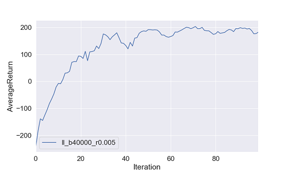
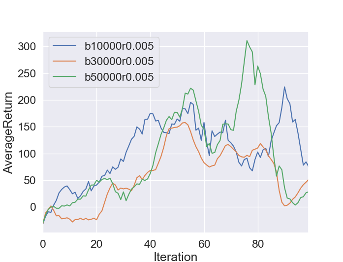

# Policy Gradient
## Homework Instructions
http://rail.eecs.berkeley.edu/deeprlcourse/static/homeworks/hw2.pdf

## CartPole-v0
#### Command line
```
python train_pg_f18.py CartPole-v0 -n 100 -b 1000 -e 1 -dna --exp_name sb_no_rtg_dna
python train_pg_f18.py CartPole-v0 -n 100 -b 1000 -e 1 -rtg -dna --exp_name sb_rtg_dna
python train_pg_f18.py CartPole-v0 -n 100 -b 1000 -e 1 -rtg --exp_name sb_rtg_na
python train_pg_f18.py CartPole-v0 -n 100 -b 5000 -e 1 -dna --exp_name lb_no_rtg_dna
python train_pg_f18.py CartPole-v0 -n 100 -b 5000 -e 1 -rtg -dna --exp_name lb_rtg_dna
python train_pg_f18.py CartPole-v0 -n 100 -b 5000 -e 1 -rtg --exp_name lb_rtg_na
```
#### args
```
-n : Number of iterations.
-b : Batch size (number of state-action pairs sampled while acting according to the
current policy at each iteration).
-e : Number of experiments to run with the same configuration. Each experiment
will start with a different randomly initialized policy, and have a different stream of
random numbers.
-dna : Flag: if present, sets normalize_advantages to False. Otherwise, by
default, normalize_advantages=True.
-rtg : Flag: if present, sets reward_to_go=True. Otherwise, reward_to_go=False
by default.
--exp_name : Name for experiment, which goes into the name for the data directory.
```


```
Left: PG CartPole-v0 small batch size (1000), Right: PG CartPole-v0 large batch size (5000)
With small batch(left figure), gradient estimators using reward-to-go (sb_rtg_dna, sb_rtg_na) perform best and both learning curves are able to reach maximum average return (200). Sb_rtg_na model is able to reach maximum return in less than 20 iteration since normalizing advantage reduces variance and makes faster convergence. Similarily, with large batch(right figure), model using reward-to-go performs better. However, normalizing advantage doesn't make significant difference. This is because there the variance of performance becomes lower due to the large number of batch size. Using normalization and reward to go function, we can achieve a maximum score of 200 in both small and large batch in less than 40 iterations.
```

## InvertedPendulum-v2
#### Command line
```
python train_pg_f18.py InvertedPendulum-v2 -ep 1000 --discount 0.9 -n 100 -e 1 -l 2 -s 64 -b 3000 -lr 0.06 -rtg --exp_name ip_b3000_r0.06 

```

```
Hyperparameter tuning were performed in batch size at [1000, 2000, 3000, 4000, 5000], learning rate at [1e-2, 3e-2, 6e-2, 3e-3, 1e-3, 3e-4, 1e-4]
With batch size at 3000, learning rate at 6e-2, the policy gets to maximum score of 1000 arount 40 iterations.
```

## LunarLanderContinuous-v2
#### Command line
```
python train_pg_f18.py LunarLanderContinuous-v2 -ep 1000 --discount 0.99 -n 100 -e 1 -l 2 -s 64 -b 40000 -lr 0.005 -rtg --nn_baseline --exp_name ll_b40000_r0.005
```



## HalfCheetah-v2
#### Command line
```
python train_pg_f18.py HalfCheetah-v2 -ep 150 --discount 0.9 -n 100 -e 3 -l 2 -s 32 -b <b> -lr <r> -rtg --nn_baseline --exp_name hc_b<b>_r<r>
```


```
In the left figure, large batch makes better performance. In right figure, PG with large learning rate performs worse.
```

## Bonus: single-step PG and multi-step PG


